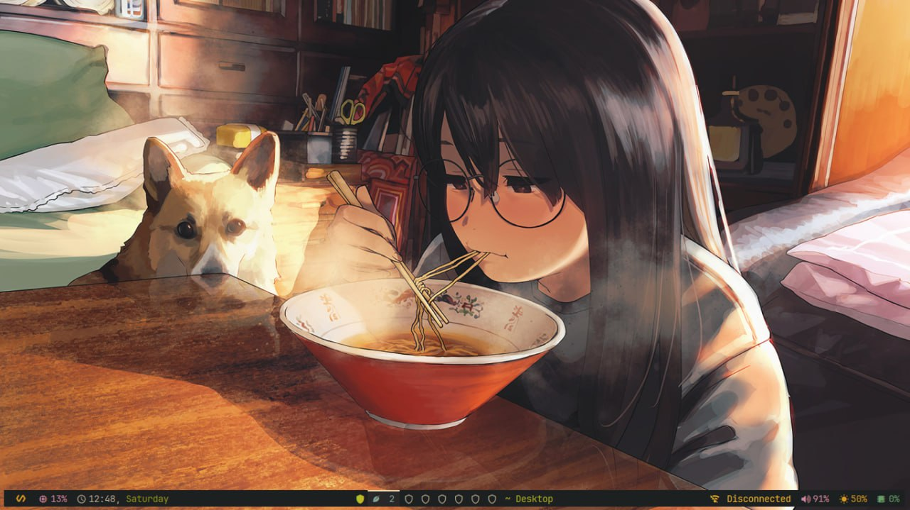
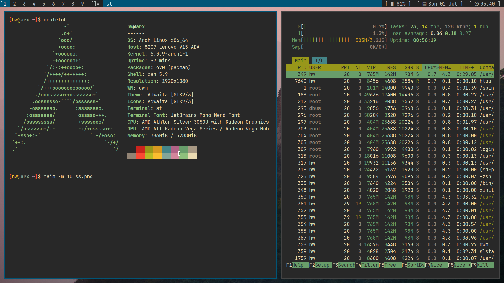
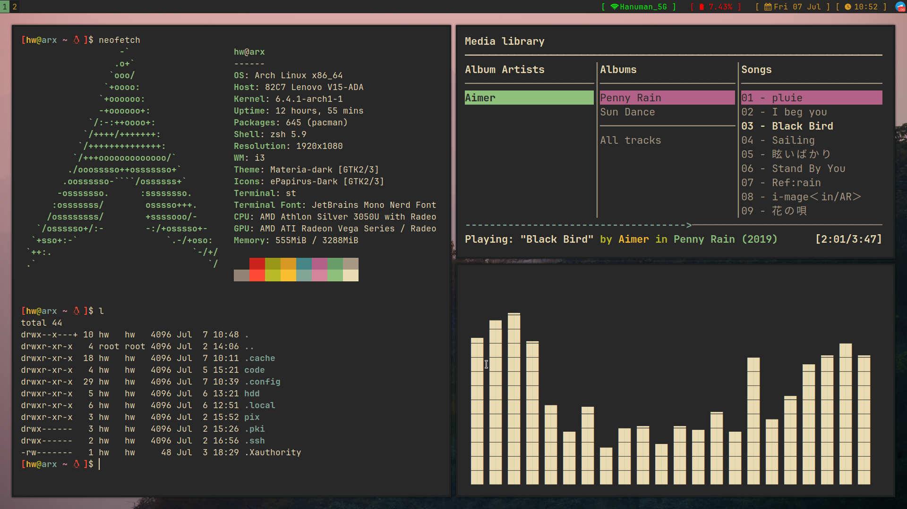

<p align="center">
  <b>🔥VS Linux Dotfiles 🔥</b>
</p> 

<h1>
  <a href="#--------">
    
  </a>
</h1>

<p align="center"> 
 


</p> 

</br>


<div align="center">
 


Heyyo, Thanks for dropping by....this is a place where I showcase my dotfiles on the Internet. You'll find my shitty/beautiful/cool configurations here :D. This is my personal configuration of BSPWM/i3/Dwm Window Manager. But, now i personally use BSPWM.ALSO my Main OS is Debian Testing. But these configurations will work on all of the GNU/Linux Distributions.


| Type                | Choice         |
| ------------------- | -------------- |
| Shell               | ZSH           |
| Color scheme        | Everblush or Materia|
| Distribution        | All GNU/Linux    |
| Windows Manager    |  DWM/BSPWM/I3    |
| IDE                 | Neovim, VSCode, Emacs |
| Web Browser         | Firefox  & Brave  |
| Terminal            | Alacritty  & st   |


</br>
</br>

</div>


#### BSPWM


</br>
</br>

#### DWM



</br>
</br>

#### i3





 </br>
</br>
 
 #### To be Noted 
 

  
- I use bspwm as my daily life window manager bcuz its super minimal and fulfill my needs. 
- I am using JetBrainsMono and a Custom font called [Iosevka Mayukai](https://github.com/Iosevka-Mayukai/Iosevka-Mayukai).
- [Everblush](https://github.com/mangeshrex/everblush.vim) is a dark and beautiful colorscheme which I've used in my latest rice.
- For GTK3 I use my custom [Everblush theme](https://github.com/mangeshrex/everblush-gtk) made with Phocus/gtk3. Also you might need to modify the theme according to your preference ^-^ 


- I am using tint2 as we as polybar but my default bar is tint2 in bspwm (friendship ends with polybar ;-;).
  
- Picom is default one  


#### Installation 


 - Install the following packages 
  
  ```bspwm sxhkd tint2 polybar alacritty nitrogen maim imagemagick.``` 
  

  - Clone this repository to your $HOME dir.
    ```yaml
    # clone the dotfiles repo
    $ git clone https://github.com/soiamvs/dotfiles
    # cd in dotfiles
    $ cd dotfiles/
    ```


  > After you're done with cloning the repository. Install the following packages 
  
  
  > For compository I use picom. You need to build it from the official repository. 
  
  > After you're done with all this, copy the configuration files from cloned directory to particular path. 
  
 
<br>


#### Links
 - Window Manager:
          [BSPWM](https://github.com/baskerville/bspwm) 
          [DWM](https://dwm.suckless.org/) 
          [i3](https://i3wm.org/)
 - [Suckless](https://suckless.org/) 
 - Text Editor: [Neovim](https://github.com/neovim)
 - Terminal :   [Simple Terminal](https://st.suckless.org/)
 - Music Player: Mpv or Ncmpcpp
 - Bar:  [Tint2](https://gitlab.com/o9000/tint2) & [Polybar](https://github.com/polybar/polybar)
 - Compositor: [Picom](https://github.com/yshui/picom)
 - File Manager: [Thunar](https://docs.xfce.org/xfce/thunar/start)
 - GUI Editor: [Vscode](https://github.com/microsoft/vscode)
 - App Launcher : [DMenu](https://tools.suckless.org/dmenu/)


